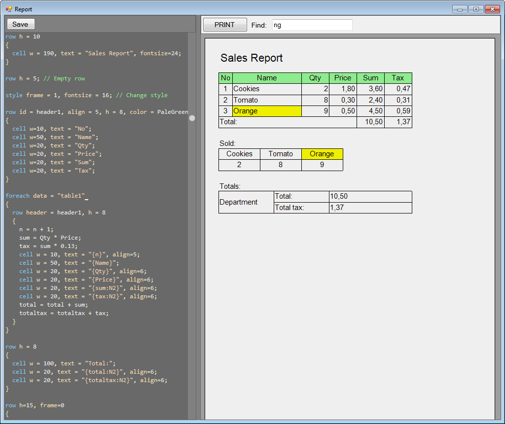

# ESReport

Report Generator with interactive editing. A tool you can use to print your JSON tables in a human-readable format.

* Simple markup.
* No third-party components.
* Variables and simple mathematical expressions.


## Command line

Usage:

```
ESReport.exe [edit] <markup file name> <json file name>
```

"edit" argument means that the program should start in "edit" mode.

If no arguments were passed to the program it will try to load "report.txt" markup file and "data.txt" data file (json) and will start in "edit" mode.

## Markup

The document is created from tables and the tables contains rows and cells.

### row

Adds a row to a table.

Area: top level of a document and inside cells.

Parameters:
* h - height in mm. Example: h=10 // define row height of 10 mm

Example:

```
row h=15 frame=1 // height 15 mm, solid 1 pt frame
{
  cell w=50 // a cell inside a row
  {
    row h=5 // first row inside a cell
    {
      cell w=50 text="Document ID:";
    }
    row h=10 // second row inside a cell
    {
      cell w=50 text="{DocumentId}";
    }
  }
}
```

### cell

Adds a cell to a row.

Area: inside rows.

Parameters:
* w - width in mm. Example: w=50 // cell width of 50 mm
* text - text inside a cell. Example text="Report"

Example:

```
row h=10
{
  cell w=190 text="Report"; // 190 mm cell with a text
}
```

### style

Sets the default style attributes.

Area: top level of a document.

Parameters:
Like in "Common style attributes".

Example:

```
style frame=2; // define 2 pt frame for tables
```

### foreach

Iterates through a data table.

Area: top level of a document and inside cells.

Parameters:
* data - table name in a data file.

Example:

```
foreach data='customers' // Use "customers" table
{
  row h=5
  {
    cell w=50, text={CustomerName}
  }
}
```

### Common style attributes

* align - text alignment. Encoding: 1 - top left, 2 - top center, 3 - top right, 4 - center left, 5 - center, 6 - center right, 7 - bottom left, 8 - bottom center, 9 - bottom right. Example: align=5 // center the text
* color - cell background color. Value: standard color name. Example: color=Gold.
* fontsize - font size in pt. Example: fontsize=28.
* frame - cell frame. Can be 1 or 4 digit long. 1 digit defines a frame's width. 4 digits defines each frame side width. The first one defines left border, the second top, third right, and the last one the bottom.


